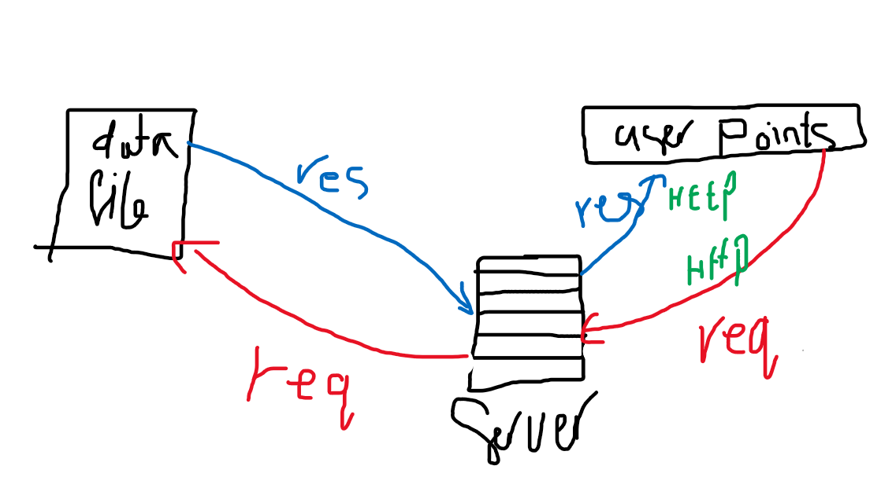

# 

# Movies-Library - 1

**Author Name**: Mohammad emad aladarbeh

## WRRC  Features

## Overview

## Getting Started
- user must install library that is required such as:  
    1. npm i express cors  
- user must call this library with use require('name Of library')  
- create server  
- call the point such as /favorite  
- get url for your websit 
- get the key 
- call listin function to run the server  
- write npm start inside terminal to run server    

## Project Features
- get the value from the data file
- connect between server and my project